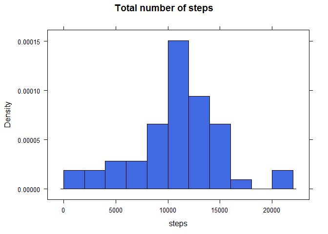
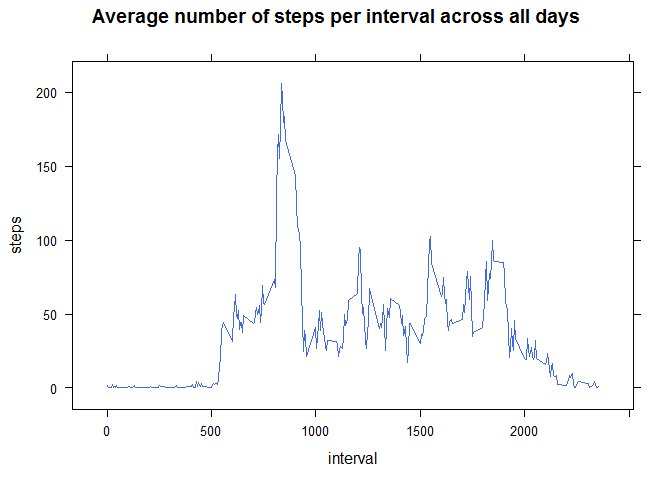
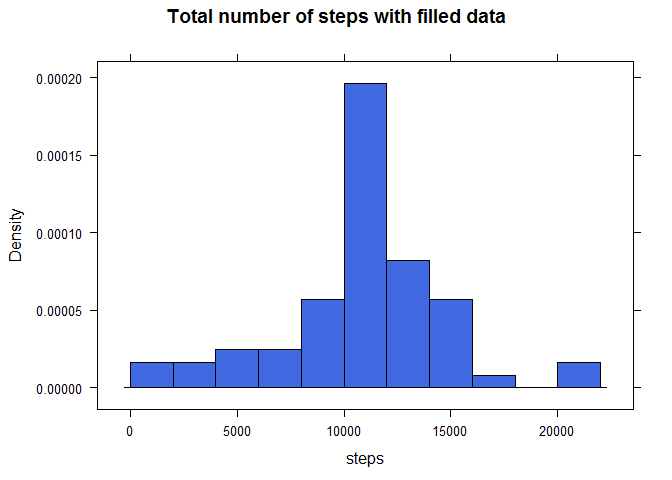
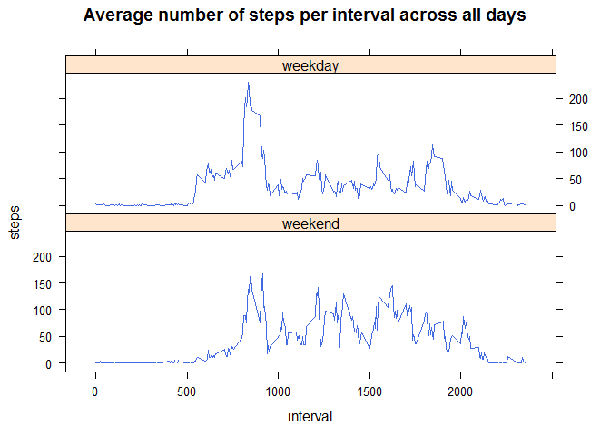

# Reproducible Research: Peer Assessment 1


## Loading and preprocessing the data


```r
unzip("activity.zip")
data <- read.csv("activity.csv", header = TRUE, colClasses=c("integer", "Date", "integer"))
```

## What is mean total number of steps taken per day?

Summarize information abouts count of steps per day:

```r
library(stats)
stepsperday <- aggregate( steps ~ date, data = data, sum )
```

Histogram of the total number of steps taken each day:

```r
library(lattice)
histogram( ~ steps, type="density", data = stepsperday, breaks = 10, col = 'royalblue',
           main = "Total number of steps") 
```

 

Mean and median of the total number of steps taken per day:

```r
stepsmean <- mean(stepsperday$steps)
stepsmedian <- median(stepsperday$steps)
print(stepsmean)
```

```
## [1] 10766.19
```

```r
print(stepsmedian)
```

```
## [1] 10765
```

## What is the average daily activity pattern?

Summarize information abouts count of steps per day:

```r
dailypattern <- aggregate( steps ~ interval, data = data, mean )
```

Time series plot of the 5-minute interval and the average number of steps taken, averaged across all days:


```r
xyplot( steps ~ interval, data = dailypattern, type = "l", col = 'royalblue',
        main = "Average number of steps per interval across all days")
```

 

Find interval, on average across all the days in the dataset, contains the maximum number of steps:

```r
dailypattern[which.max(dailypattern$steps), ]
```

```
##     interval    steps
## 104      835 206.1698
```

## Imputing missing values

Count missing values:

```r
na.steps <- which(is.na(data$steps))
length(na.steps)
```

```
## [1] 2304
```

Fill missing data using mean for that 5-minute interval. Mean/Median per day is not choosen because for first day there are no any data.


```r
dataF <- data
dataF$steps[na.steps] <- as.integer(dailypattern$steps[match(data$interval[na.steps], dailypattern$interval)])
```

Histogram of the total number of steps taken each day used data with fillea NA:


```r
stepsperdayF <- aggregate( steps ~ date, data = dataF, sum )
histogram( ~ steps, type="density", data = stepsperdayF, breaks = 10, col = 'royalblue',
           main = "Total number of steps with filled data") 
```

 

```r
stepsmeanF <- mean(stepsperdayF$steps)
stepsmedianF <- median(stepsperdayF$steps)
print(stepsmeanF)
```

```
## [1] 10749.77
```

```r
print(stepsmedianF)
```

```
## [1] 10641
```

For data with filled NAs mean and median values a little lower than for data with NAs.

## Are there differences in activity patterns between weekdays and weekends?


```r
wd <- factor( ifelse( weekdays(data$date) %in% c("Saturday", "Sunday"), "weekend", "weekday" ), 
              levels = c("weekend", "weekday") )
dailypatternW <- aggregate( steps ~ interval + wd, data = cbind(dataF, wd), mean )
xyplot( steps ~ interval | wd, data = dailypatternW, type = "l", col = 'royalblue', layout = c(1, 2),
        main = "Average number of steps per interval across all days")
```

 
